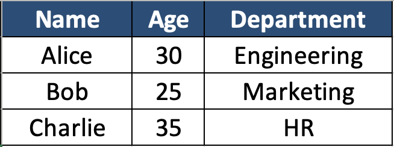
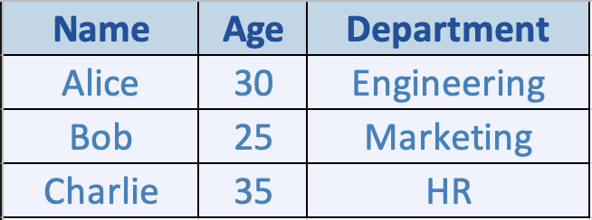
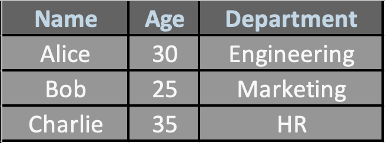
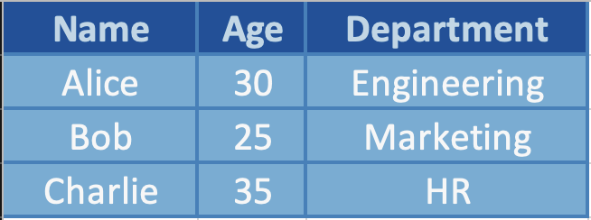
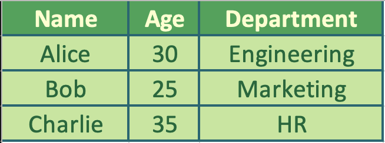
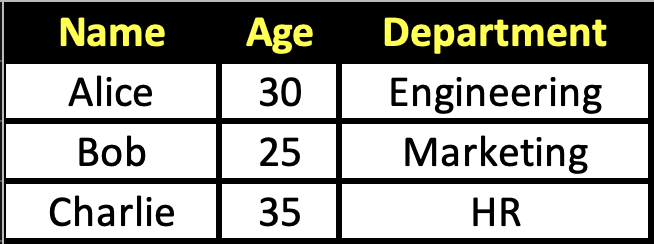

# Excel Report Generator
The Excel Report Generator (ERG) is a microservice that creates and formats an Excel report based on received data. 
Clients can request an Excel report by specifying headers, rows (data), whether the report should be sorted by a column,
and whether one of the styling templates should be applied. The ERG responds with the absolute file path of the
generated report. 

## Communication Contract
The ERG utilizes ZeroMQ to handle communication between itself and the client. Continue reading below for instructions 
on requesting and receiving data, along with example calls. 

## Requesting Data

### Request Instructions
1. Import the zmq and json packages. 
2. Open a new request socket connected to localhost port number 5727.
3. Prepare your data in the required format (see _Request Format_ section below). 
4. Convert the dictionary to JSON format. 
5. Send the JSON content through your connected socket. 

### Request Format
```javascript
example_request = {
    'Headers': ['header1', 'header2', 'header3', 'header4'], 
    'Rows': [
        ['row1-col1', 'row1-col2', 'row1-col3', 'row1-col4'], 
        ['row2-col1', 'row2-col2', 'row2-col3', 'row2-col4']
        // Etc.
    ],
    'sort_by': 'header2', // must match the name of one of the Header values.
    'style': 'templateName' // must match the name of one of the pre-defined templates. 
}
```
_Request Format Notes:_

- If the Excel file doesn't need to be sorted by a column or doesn't need a style template applied, omit those keys entirely.
- Each row must have the same number of entries as the number of headers (i.e. each row must have a value for each header item).
- If a header is provided for sort_by, the rows will be sorted by their value in ascending order. 

### Example Call (Request)
```python
import zmq
import json

# Setup communication (client)
context = zmq.Context()
socket = context.socket(zmq.REQ)
socket.connect("tcp://localhost:5727")

# Example report request
request = {
    'Headers': ['ID', 'Date', 'Name', 'Sale Amount'],
    'Rows': [
        [7, '2024/10/05', 'John Doe', 35.24],
        [4, '2024/07/02', 'Jim Doe', 70],
        [10, '2024/12/15', 'Jane Doe', 25]
    ],
    'sort_by': 'ID',
    'style': 'Blue'
}

# Convert request to JSON & send
request_json = json.dumps(request)
socket.send_string(request_json)
```

## Receiving Data

### Response Instructions

1. Import the zmq and json packages. 
2. Open a new request socket connected to localhost port number 5727.
3. Make the request (follow instructions above). 
4. Create a response variable (i.e. message) and set the socket to receive. 
5. Decode the received response to the utf-8 format. 

After following the steps above, you will have a string containing the absolute file path of the generated Excel report.
This can be utilized however best fits the client program (i.e. displaying the path to the end user, or serving it as a
download in your web app).

### Example Call (Response)
```python
import zmq

# Setup communication (client)
context = zmq.Context()
socket = context.socket(zmq.REQ)
socket.connect("tcp://localhost:5727")

# Make Request (see above)

# Receive filepath and decode back to a string
message = socket.recv().decode('utf-8')
```

## UML Sequence Diagram


## Style Templates

The ERG supports optional predefined Excel styling templates.  
If you wish to apply styling, include a `style` key in your request and set its value to one of the template names defined below.  
If omitted, the generated report will use default Excel formatting.

### Example call
```python
request = {
    "Headers": ["Name", "Age", "Department"],
    "Rows": [
        ["Alice", 30, "Engineering"],
        ["Bob", 25, "Marketing"],
        ["Charlie", 35, "HR"]
    ],
    "sort_by": "Age",
    "style": "green"
}
```

### Style Previews

| Template Name     | Preview |
|------------------|--------|
| **default**       |  |
| **light**         |  |
| **dark**          |  |
| **blue**          |  |
| **green**         |  |
| **high_contrast** |  |
